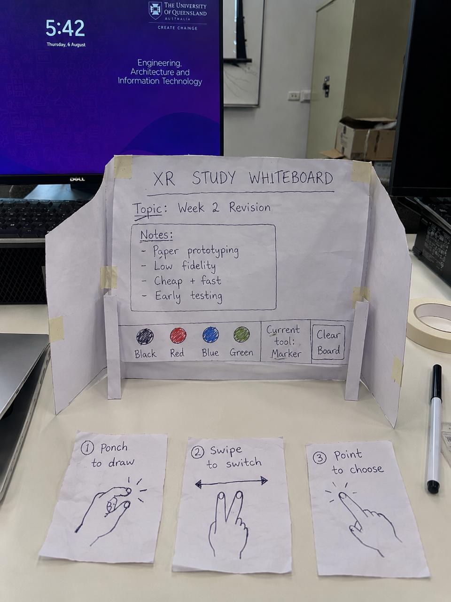

# XR Study Whiteboard

> A gesture-driven virtual whiteboard for studying, revision, brainstorming, and note-taking in XR.

  

<em>Week 2 · Completed interaction demo</em>

## Project snapshot

| | |
| --- | --- |
| **Course** | DECO2300 – Digital Prototyping and Extended Reality |
| **Student** | Andhika Nayaka Arya Wibowo |
| **Concept** | XR Study Whiteboard |
| **Demo outcome** | Week 2 paper demo completed; IP1 core workflow completed by five participants |
| **Testing methods** | Wizard-of-Oz, think aloud, and task-based user testing |

The XR Study Whiteboard gives students a focused virtual study space where they can write notes with simple hand gestures while keeping the atmosphere of a classroom.

## Documentation

- [Week 2 — Paper demo, testing results, and reflection](DesignProcess/Week02_PaperPrototype/README.md)

## Digital Prototype

The Unity prototype is implemented in `Whiteboard` using Unity `6000.3.21f1` with URP, OpenXR, XR Interaction Toolkit, XR Hands, and the Input System.

Current features include:

- Continuous controller and hand pinch drawing on the whiteboard, with interpolated marker strokes and a wider eraser.
- Black, red, blue, and green marker colours with visible tool/status feedback.
- Clear-board confirmation.
- Student tables with paper-only surfaces. Each table has a `TOOLS` button that opens floating `PENCIL`, `ERASER`, and `CLEAR PAPER` actions. The paper pencil line is intentionally finer than the whiteboard marker.
- Table teleport/view shortcuts that focus the paper while keeping the whiteboard visible, plus floor teleportation and snap turning.
- Editor testing through the XR Device Simulator and desktop fallback controls.

The original paper-prototyping process is preserved under `DesignProcess/`. Start with the [digital prototype setup guide](Whiteboard/Documentation/SETUP.md).

## Key outcome

The first five participant sessions show that the core writing workflow can be completed on both the wall whiteboard and table paper. The whiteboard was the easiest surface to use, while the table tools were the main discoverability issue. Participants also saw the classroom concept as useful for students who are easily distracted during online classes and for homeschooling because it can recreate some of the focus and structure of a classroom.

## Design Evaluation 1 user testing

Five classmates tested the IP1 Unity prototype. Three sessions have full audio transcript PDFs and two sessions have checklist-only evidence. All five participants completed the core workflow and the checklist-only participants were satisfied.

The repeated findings were:

- The wall whiteboard was easier to understand than the table paper.
- The table `PENCIL`, `ERASER`, and `CLEAR PAPER` tools were difficult to notice or read at first.
- One participant described paper drawing as slightly glitchy, so paper drawing needs another focused retest even though the task was completed.
- The teleport control was not immediately visible to one participant, so the navigation affordance should be larger or have a clearer hint.
- Participants saw the concept as useful for focused online learning and homeschooling. Future ideas included a larger classroom, more tables, more whiteboard features, and possible multiplayer support.

Read the [interview evidence README](Design%20Evaluation/Interview%20Transcripts/README.md), the [full transcript files](Design%20Evaluation/Interview%20Transcripts/), and the [updated Design Evaluation 1 guide](Design%20Evaluation/Design%20Evaluation%201%20XR%20User%20Testing%20Guide.pdf).

## Digital XR Implementation

The existing `Whiteboard` Unity project now contains the main scene at [`Whiteboard/Assets/XRStudyWhiteboard/Scenes/XRStudyClassroom.unity`](Whiteboard/Assets/XRStudyWhiteboard/Scenes/XRStudyClassroom.unity). It includes a lightweight classroom, a runtime whiteboard with black/red/blue/green marker colours, Marker/Eraser modes, clear-board confirmation, controller drawing, optional pinch drawing, teleportation, snap turning, and a grabbable marker.

The implementation reuses the existing VR template XR Origin, OpenXR, XRI Starter Assets, XRI input actions, locomotion, and XR Hands infrastructure. See [`Whiteboard/Documentation/SETUP.md`](Whiteboard/Documentation/SETUP.md) for setup, [`Whiteboard/Documentation/CONTROLS.md`](Whiteboard/Documentation/CONTROLS.md) for controls, and [`Whiteboard/Documentation/IMPLEMENTATION_STATUS.md`](Whiteboard/Documentation/IMPLEMENTATION_STATUS.md) for testing status and limitations.
